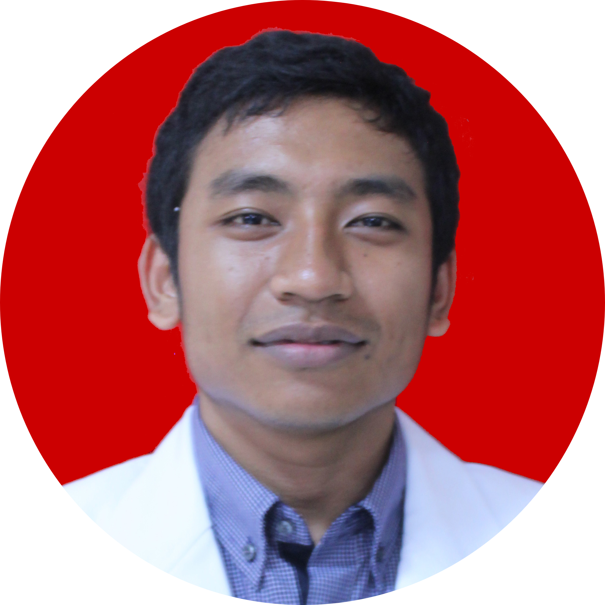

```{r, include=FALSE}
knitr::opts_chunk$set(
  results='asis', 
  echo = FALSE
)

library(magrittr) # For the pipe
source("cv_printing_functions.r")

# Read in all data and initialize a CV printer object
CV <- create_CV_object(
  data_location = "https://docs.google.com/spreadsheets/d/1QBk5tWxkVf2n-vr2u2ysb9GxS4ljc1bMuEHxtkk0bqA/edit#gid=917338460",  
  pdf_mode = params$pdf_mode
)

```


```{r}
# When in pdf export mode the little dots are unaligned, so fix that with some conditional CSS.
if(params$pdf_mode) {
    cat("
<style>
:root{
  --decorator-outer-offset-left: -6.5px;
}
</style>")
}
```


Aside
================================================================================

```{r}
# Build interactive network of positions colored by section
# and connected if they occurred in the same year
# datadrivencv::build_network_logo(CV$entries_data)
```

```{r foto, echo=FALSE}

```

* **dr. Kadek Adit Wiryadana**
* Usia `r round(((Sys.Date() - as.Date("1996-06-02"))/365),digits=0)` Tahun
* Lahir di Singaraja, 2 Juni 1996
* Alamat: Jalan Mayor Metra Gg IV no. 2 Liligundi, Singaraja

Kontak {#contact}
--------------------------------------------------------------------------------

```{r}
CV %>% print_contact_info()
```

Skill lain {#skills}
--------------------------------------------------------------------------------

```{r}
CV %>% print_skill_bars()
```


Disclaimer {#disclaimer}
--------------------------------------------------------------------------------

CV dibuat dengan R. Kode dapat diakses pada [github](https://github.com/wiryadana/my_CV).
Diperbaharui pada `r Sys.Date()`.
```{r}
if(params$pdf_mode){
  cat("CV dapat diakses online pada _https://wiryadana.tech/wiryadana_cv/cv.html")
} else {
  cat("[<i class='fas fa-download'></i> Download a PDF of this CV](https://github.com/wiryadana/my_CV/blob/main/wiryadana_cv.pdf)")
}
```

Main
================================================================================

Kadek Adit Wiryadana {#title}
--------------------------------------------------------------------------------

```{r}
# Note the special double pipe so we modify the CV object in place
CV %<>% print_text_block("intro") 
```


Pendidikan {data-icon=graduation-cap data-concise=true}
--------------------------------------------------------------------------------

```{r}
CV %<>% print_section('education')
```


Pelatihan dan Sertifikasi {data-icon=laptop}
--------------------------------------------------------------------------------

```{r}
CV %<>% print_section('pelatihan')
```


Pengalaman Kerja {data-icon=suitcase}
--------------------------------------------------------------------------------

::: aside
```{r}
CV %<>% print_text_block('industy_experience_aside')
```
:::

```{r}
CV %<>% print_section('industry_positions')
```

<!-- These breaks just force a new page so section doesnt get cut off -->
\newpage

Pengalaman Mengajar {data-icon=chalkboard-teacher}
--------------------------------------------------------------------------------

::: aside
```{r}
# CV %<>% print_text_block('teaching_experience_aside')
```
:::

```{r}
CV %<>% print_section('teaching_positions')
```


Penghargaan {data-icon=chart-line}
--------------------------------------------------------------------------------

::: aside
```{r}
# CV %<>% print_text_block('data_science_writing_aside')
```
:::

```{r}
CV %<>% print_section('awards')
```


Pengabdian Masyarakat  {data-icon=newspaper}
--------------------------------------------------------------------------------

```{r}
CV %<>% print_section('pengabdian_masyarakat')
```


<br>


Publikasi Ilmiah {data-icon=book}
--------------------------------------------------------------------------------

```{r}
CV %<>% print_section('academic_articles')
```

<br>

::: aside
```{r}
# Build interactive network of positions colored by section
# and connected if they occurred in the same year
#datadrivencv::build_network_logo(CV$entries_data)
```
:::

```{r}
CV %<>% print_links()
```

